w# PayerSync Onboarder Backend Architecture

This document provides a comprehensive overview of the PayerSync Onboarder Backend architecture based on the actual implementation.

## System Architecture Diagram

### Overview
The system processes Adyen webhooks to automatically complete user onboarding by creating sweeps (automatic fund transfers) and confirming onboarding status when all verification requirements are met.

```mermaid
graph TD
    %% Client Applications
    Client[Client Application] -->|Authenticates| Cognito
    Client -->|API Requests| HTTPAPI[HTTP API Gateway]
    
    %% Adyen Webhook
    Adyen[Adyen Payment Platform] -->|Webhook Events| RESTAPI[REST API Gateway]
    RESTAPI -->|Basic Auth| WebhookAuthorizer[Webhook Authorizer Lambda]
    RESTAPI -->|POST /adyen/webhook| WebhookHandler[Webhook Handler Lambda]

    %% Authentication
    subgraph Authentication
        Cognito[Cognito User Pool]
        Cognito -->|Post Confirmation Trigger| PostConfirmLambda[Post Confirmation Lambda]
        PostConfirmLambda -->|Publishes| LeadEventTopic
    end

    %% API Gateway
    subgraph API_Gateway
        HTTPAPI[HTTP API Gateway]
        HTTPAPI -->|Authorizes| Cognito
        HTTPAPI -->|POST /payload| PayloadLambda[Payload Handler Lambda]
        HTTPAPI -->|GET /payload| GetPayloadLambda[Get Payload Handler Lambda]
        HTTPAPI -->|POST /generate-link| GenerateLinkLambda[Generate Onboarding Link Lambda]

        HTTPAPI -->|GET /reporting/*| ReportingLambda[Reporting Lambda]
        HTTPAPI -->|Test Data| TestDataLambda[Test Data Handler Lambda]
    end
    
    %% Webhook API Gateway
    subgraph Webhook_API_Gateway
        RESTAPI[REST API Gateway]
        RESTAPI -->|Basic Auth| WebhookAuthorizer
        RESTAPI -->|POST /adyen/webhook| WebhookHandler
    end

    %% Event Processing
    subgraph Event_Processing
        WebhookHandler -->|Emits Events| EventBridge[EventBridge Custom Bus]
        EventBridge -->|Standard Events| StandardHandler[Standard Notification Handler]
        EventBridge -->|KYC Events| KYCHandler[KYC Notification Handler]
        EventBridge -->|Transfer Events| TransferHandler[Transfer Notification Handler]
        EventBridge -->|Balance Platform Events| OnboardingCompletionHandler[Onboarding Completion Handler]
        LeadEventTopic[SNS Lead Event Topic]
        OnboardedEventTopic[SNS Onboarded Event Topic]
        LeadEventTopic -->|Subscription| Zapier[Zapier Integration]
        OnboardedEventTopic -->|Subscription| ExternalSystems[External Systems]
    end

    %% Data Storage
    subgraph Data_Storage
        DynamoDB[(DynamoDB Table)]
        S3Webhooks[(S3 Webhook Storage)]
        RDS[(RDS PostgreSQL)]
        DynamoDB -->|Stream| StreamHandler[DynamoDB Stream Handler Lambda]
        StreamHandler -->|Publishes| OnboardedEventTopic
        WebhookHandler -->|Stores Raw Payloads| S3Webhooks
        StandardHandler -->|Writes| RDS
        KYCHandler -->|Writes| RDS
        TransferHandler -->|Writes| RDS
    end

    %% Lambda Functions
    PayloadLambda -->|Writes| DynamoDB
    GetPayloadLambda -->|Reads| DynamoDB
    GenerateLinkLambda -->|Reads/Writes| DynamoDB
    GenerateLinkLambda -->|Calls| AdyenAPI[Adyen APIs]
    OnboardingCompletionHandler -->|Reads/Writes| DynamoDB
    OnboardingCompletionHandler -->|Calls| AdyenAPI
    WebhookHandler -->|Validates HMAC| SecretsManager
    WebhookAuthorizer -->|Validates Basic Auth| SecretsManager
    ReportingLambda -->|Reads| RDS

    %% Security
    subgraph Security
        KMS[KMS Key]
        SecretsManager[AWS Secrets Manager]
        KMS -->|Encrypts| SecretsManager
    end

    %% Monitoring
    subgraph Monitoring
        CloudWatch[CloudWatch Logs]
        XRay[X-Ray Tracing]
    end

    %% Connections to Monitoring
    HTTPAPI -->|Logs| CloudWatch
    RESTAPI -->|Logs| CloudWatch
    PayloadLambda -->|Logs & Traces| CloudWatch
    PayloadLambda -->|Traces| XRay
    GetPayloadLambda -->|Logs & Traces| CloudWatch
    GetPayloadLambda -->|Traces| XRay
```



## Onboarding Completion Flow

### Prerequisites for Full Onboarding
A user is considered **fully onboarded** when **ALL** of these conditions are met:

1. **✅ All Verification Statuses Complete** (6 required capabilities):
   - `receivePayments: true`
   - `sendToTransferInstrument: true` 
   - `sendToBalanceAccount: true`
   - `receiveFromBalanceAccount: true`
   - `receiveFromTransferInstrument: true`
   - `receiveFromPlatformPayments: true`

2. **✅ Transfer Instrument Available**: Must have a valid transfer instrument ID
3. **✅ Balance Account Available**: Must have a valid balance account ID
4. **✅ Sweep Successfully Created**: Must have a valid sweep ID

### What is a Sweep?
A **sweep** is an Adyen Balance Platform configuration that:
- **Automatically transfers funds** from a balance account to a transfer instrument (bank account)
- **Runs daily** (`schedule: { type: 'daily' }`)
- **Triggers at $0** (`triggerAmount: { value: 0 }`) - meaning it transfers all available funds
- **Uses both regular and fast priorities** for optimal fund movement
- **Is a "push" type** - moves money out of Adyen to the user's bank

### Complete Flow Breakdown

#### Phase 1: Webhook Reception
1. **Adyen sends webhook** → `adyenWebhookHandler` receives it
2. **Webhook validation** → HMAC signature validation (skipped for Balance Platform webhooks)
3. **Event classification** → Identified as `balancePlatform.accountHolder.updated`
4. **Event emission** → Structured event sent to EventBridge

#### Phase 2: EventBridge Routing
1. **EventBridge rule** → `balancePlatformNotificationRule` catches the event
2. **Event pattern matching** → `notificationType: 'balancePlatform'`
3. **Lambda invocation** → Triggers `onboardingCompletionHandler`

#### Phase 3: Onboarding Completion Processing
1. **User lookup** → Find user by `accountHolderId` from webhook
2. **Verification status check** → Parse Adyen capabilities and update verification statuses
3. **Transfer instrument extraction** → Get transfer instrument ID from capabilities
4. **Sweep creation attempt** → Only if all verifications are complete
5. **Status update** → Mark user as `ONBOARDED` if all conditions met

#### Phase 4: DynamoDB Stream Processing
1. **DynamoDB stream** → Triggers when user status changes to `ONBOARDED`
2. **Stream handler** → `onboardingTableStreamHandler` processes the change
3. **SNS event** → Publishes `ORGANIZATION_ONBOARDED` event to SNS topic

### Key Decision Points

#### When to Create Sweep:
```typescript
const canAttemptSweepCreation =
  allVerificationsComplete &&           // All 6 verifications must be true
  finalTransferInstrumentId &&          // Must have transfer instrument
  existingAdyenData.balanceAccountId && // Must have balance account
  !existingAdyenData.sweepId;          // Must not already have sweep
```

#### When to Mark as ONBOARDED:
```typescript
const shouldMarkAsOnboarded = 
  allVerificationsComplete &&           // All verifications complete
  sweepCreated &&                       // Sweep successfully created
  user.status !== OnboardingStatus.ONBOARDED; // Not already onboarded
```

### Final Confirmation Trigger
The **ONBOARDED** status triggers a **cascade of events**:

1. **DynamoDB update** → User status changed to `ONBOARDED` + `onboardedAt` timestamp
2. **DynamoDB stream** → Automatically triggers due to status change
3. **SNS event** → `ORGANIZATION_ONBOARDED` event published
4. **Downstream systems** → Can consume the SNS event for further processing

This creates a **fully automated financial flow** where users can receive payments through Adyen and have funds automatically swept to their bank accounts on a daily basis.
    GenerateLinkLambda -->|Logs & Traces| CloudWatch
    GenerateLinkLambda -->|Traces| XRay
    OnboardingCompletionHandler -->|Logs & Traces| CloudWatch
    OnboardingCompletionHandler -->|Traces| XRay
    PostConfirmLambda -->|Logs & Traces| CloudWatch
    StreamHandler -->|Logs & Traces| CloudWatch
    StreamHandler -->|Traces| XRay
    WebhookHandler -->|Logs & Traces| CloudWatch
    WebhookHandler -->|Traces| XRay
    WebhookAuthorizer -->|Logs & Traces| CloudWatch
    WebhookAuthorizer -->|Traces| XRay
    StandardHandler -->|Logs & Traces| CloudWatch
    StandardHandler -->|Traces| XRay
    KYCHandler -->|Logs & Traces| CloudWatch
    KYCHandler -->|Traces| XRay
    TransferHandler -->|Logs & Traces| CloudWatch
    TransferHandler -->|Traces| XRay
    ReportingLambda -->|Logs & Traces| CloudWatch
    ReportingLambda -->|Traces| XRay
    TestDataLambda -->|Logs & Traces| CloudWatch
    TestDataLambda -->|Traces| XRay
    WebhookTestLambda -->|Logs & Traces| CloudWatch
    WebhookTestLambda -->|Traces| XRay
```

## Tech Stack

### Core Technologies
- **Node.js**: Runtime environment (v24.2.0)
- **TypeScript**: Programming language for type-safe development
- **AWS CDK**: Infrastructure as Code framework for defining cloud resources (v2.201.0)

### AWS Services
- **Lambda**: Serverless compute for all backend functions (Node.js 20.x runtime)
- **HTTP API Gateway**: RESTful API endpoints with Cognito authorization
- **REST API Gateway**: Webhook endpoints with Basic Auth authorization
- **Cognito**: User authentication and authorization with custom attributes
- **DynamoDB**: NoSQL database for storing onboarding data with stream processing
- **RDS PostgreSQL**: Relational database for enhanced webhook processing and reporting
- **S3**: Object storage for webhook payloads with lifecycle management
- **EventBridge**: Custom event bus for webhook event routing and processing
- **SNS**: Event notification for lead generation and completed onboarding
- **KMS**: Encryption for sensitive data (API keys and secrets)
- **AWS Secrets Manager**: Secure storage for Adyen API keys and webhook credentials
- **CloudWatch**: Logging, monitoring, and alerting
- **X-Ray**: Distributed tracing for performance monitoring
- **IAM**: Identity and access management for secure resource access

### External Integrations
- **Adyen**: Payment processor integration with multiple APIs:
  - Legal Entity Management (LEM) API
  - Business Platform (BP) API
  - Payment Service Provider (PSP) API
  - Webhook notifications with HMAC signature validation
- **Zapier**: Workflow automation integration via SNS with dedicated IAM user

### Development Tools
- **Jest**: Testing framework for unit and integration tests
- **ESLint/Prettier**: Code quality and formatting
- **esbuild**: JavaScript bundler for Lambda functions
- **CDK Nag**: Security and compliance checks for infrastructure
- **GitHub Actions**: CI/CD for automated testing, security scanning, and deployment

## Component Description

### Client Interaction
- **Client Application**: Web or mobile application that interacts with the backend
- **Cognito User Pool**: Handles user authentication and authorization with email, given name, and family name attributes
- **HTTP API Gateway**: Provides RESTful API endpoints secured by Cognito with CORS support

### Webhook Integration
- **Adyen Payment Platform**: Sends webhook notifications for payment events
- **REST API Gateway**: Provides public webhook endpoint with Basic Auth
- **Webhook Authorizer**: Validates Basic Auth credentials from AWS Secrets Manager
- **Webhook Handler**: Processes webhook notifications with HMAC signature validation and emits events to EventBridge

### Event Processing Architecture
- **EventBridge Custom Bus**: Centralized event routing for webhook notifications
- **Event Rules**: Route different notification types to appropriate handlers:
  - Standard notifications → Standard Notification Handler
  - KYC notifications → KYC Notification Handler
  - Transfer notifications → Transfer Notification Handler
  - Balance Platform notifications → **Onboarding Completion Handler**
- **Notification Handlers**: Process specific event types and store data in PostgreSQL

### API Endpoints

#### HTTP API Gateway (Cognito JWT Authentication Required)
- `POST /payload` - Stores and merges onboarding data (PMB data and merchant data)
- `GET /payload` - Retrieves user's onboarding data
- `POST /generate-link` - Generates Adyen hosted onboarding link

- `GET /reporting/schema` - Retrieves database schema information
- `GET /reporting/schema/{tableName}` - Gets specific table schema
- `GET /reporting/data` - Retrieves reporting data with filtering, sorting, and pagination
- `GET /reporting/stats` - Gets basic reporting statistics
- `GET /reporting/stats/analytics` - Retrieves analytics data for charts

#### REST API Gateway (Basic Auth Authentication)
- `POST /adyen/webhook` - Receives Adyen webhook notifications (requires Basic Auth)
- `GET /adyen/webhook` - Health check endpoint for webhook service (no auth required)

#### Test Data Management Endpoints (Query Parameter Based)
- `GET /test-data?action=add` - Creates test onboarding sessions and events
- `GET /test-data?action=query` - Queries test data from database
- `GET /test-data?action=clear` - Cleans up test data

**Note**: The test data handler is defined in the CDK stack but doesn't have explicit route definitions. It uses query parameters to determine the action.

#### Data Flow
1. Users register and authenticate through Cognito
2. Upon confirmation, a lead event is published to SNS
3. Authenticated users can submit onboarding data via API Gateway
4. Payload data is stored in DynamoDB with merging capabilities
5. DynamoDB streams trigger processing of new/updated records
6. When onboarding is complete, an event is published to SNS
7. Adyen sends webhook notifications for payment events
8. Webhook notifications are validated, logged, and stored in S3
9. Webhook events are emitted to EventBridge for processing
10. EventBridge routes events to appropriate notification handlers
11. Notification handlers process events and store data in PostgreSQL

### Lambda Functions

#### Core Functions
- **Payload Handler**: Processes and stores onboarding data with deep merging capabilities
- **Get Payload Handler**: Retrieves user onboarding data from DynamoDB
- **Generate Onboarding Link Handler**: Creates Adyen hosted onboarding links and manages Adyen entity creation
- **Post Confirmation Handler**: Triggered after user confirmation, publishes lead events
- **DynamoDB Stream Handler**: Processes changes to DynamoDB records and publishes onboarded events
- **Test Data Handler**: Manages test data creation, querying, and cleanup for development/testing

#### Webhook Functions
- **Webhook Handler**: Processes Adyen webhook notifications with HMAC validation, S3 storage, and EventBridge emission
- **Webhook Authorizer**: Validates Basic Auth credentials for webhook endpoint security
- **Standard Notification Handler**: Processes standard webhook notifications and stores data in PostgreSQL
- **KYC Notification Handler**: Processes KYC-related webhook notifications and stores data in PostgreSQL
- **Transfer Notification Handler**: Processes transfer-related webhook notifications and stores data in PostgreSQL

#### Reporting Functions
- **Reporting Lambda**: Handles reporting endpoints for schema, data, and statistics
- **Database Initialization**: CloudFormation custom resource for PostgreSQL schema setup

#### Adyen Integration Functions
- **Adyen API Client**: Manages API calls to Adyen services (LEM, BP, PSP)
- **Secrets Service**: Securely retrieves Adyen API keys from AWS Secrets Manager

### Storage

#### DynamoDB
Stores user onboarding data with the following structure:
- `userId` (partition key)
- `pmbData` (JSON string)
- `merchantData` (JSON string)
- `adyenData` (JSON string)
- `status` (onboarding status)
- `submissionCount` (number of submissions)
- `createdAt` and `updatedAt` timestamps

#### RDS PostgreSQL (Enhanced Schema)
Enhanced database schema for webhook processing and reporting:

**Legal Entities Dimension (SCD Type 2)**
- `legal_entities`: Stores legal entity information with SCD Type 2 support
- Tracks business names, types, country codes, and status changes over time

**Account Holders Dimension (SCD Type 2)**
- `account_holders`: Stores account holder information with SCD Type 2 support
- Links to legal entities and tracks status changes

**Accounts Dimension**
- `accounts`: Stores account information including types, currencies, and status

**Event Fact Table**
- `adyen_events`: Stores all webhook events with full JSONB payload
- Links events to entities and tracks processing timestamps

**Webhook Receipts Audit Trail**
- `webhook_receipts`: Tracks webhook processing status and validation results
- Includes HMAC validation status and error messages

**Deduplication Registry**
- `dedupe_registry`: Prevents duplicate event processing
- Tracks PSP references and event codes

#### AWS Secrets Manager
Stores encrypted credentials:
- Adyen API keys (LEM, BP, PSP)
- Webhook HMAC secret for signature validation
- Webhook Basic Auth credentials (username/password)

#### S3 Webhook Storage
Stores raw webhook payloads with the following structure:
- Bucket: `{app-name}-{environment}-adyen-webhooks`
- Path: `adyen-webhooks/{YYYY}/{MM}/{DD}/{UUID}.json`
- Lifecycle: 1 year retention with IA/Glacier transitions

### Event Processing
- **EventBridge Custom Bus**: Routes webhook events to appropriate handlers
- **Event Rules**: 
  - Standard notification rule for general events
  - KYC notification rule for KYC-specific events
  - Transfer notification rule for transfer events
  - Balance Platform notification rule for platform events
- **SNS Topics**: 
  - Lead Event Topic: Publishes events for user registration
  - Onboarded Event Topic: Publishes events for completed onboarding
- **Zapier Integration**: Dedicated IAM user with SNS permissions for workflow automation

### Security
- **KMS**: Encrypts sensitive data, API keys, and webhook secrets
- **IAM Roles**: Enforces least privilege access for all Lambda functions
- **Cognito Authorization**: JWT-based authentication for all API endpoints
- **Basic Auth**: Username/password authentication for webhook endpoints
- **HMAC Validation**: Cryptographic signature validation for webhook authenticity
- **CORS Configuration**: Environment-specific allowed origins
- **TLS Enforcement**: Minimum TLS v1.2 for all API communications

### Monitoring
- **CloudWatch**: Logs and metrics for all Lambda functions and API Gateways
- **X-Ray**: Distributed tracing for performance monitoring and debugging
- **CDK Nag**: Security and compliance checks during deployment
- **Structured Logging**: JSON-formatted logs for webhook events with key fields:
  - `eventCode`, `pspReference`, `merchantAccountCode`, `notificationType`, `live`, `timestamp`, `webhookId`

### Environment Configuration
- **Dynamic Environment Support**: Supports any environment name without hardcoded configurations
- **Environment Variables**: Configurable via `.env` files and CI/CD variables
- **Adyen Configuration**: Environment-specific API URLs and merchant accounts
- **Webhook Configuration**: Environment-specific HMAC secrets and Basic Auth credentials
- **CORS Configuration**: Environment-specific allowed origins

### Deployment
- **Dynamic Deployment**: Uses `npm run deploy <environment>` for any environment
- **Hotswap Support**: Fast iteration with `npm run deploy:hotswap <environment>`
- **Infrastructure as Code**: Complete infrastructure defined in CDK with proper tagging and removal policies
- **Security Compliance**: CDK Nag integration for security best practices

### Data Flow Details

#### User Registration Flow
1. User registers through Cognito
2. Post Confirmation Lambda triggers
3. Lead event published to SNS
4. Zapier receives notification for CRM integration

#### Onboarding Data Flow
1. User submits onboarding data via `POST /payload`
2. Data is merged with existing data (if any)
3. Submission count is incremented
4. Data stored in DynamoDB
5. DynamoDB stream triggers processing
6. If merchant data is present, onboarded event is published

#### Adyen Integration Flow
1. User requests onboarding link via `POST /generate-link`
2. System creates/verifies Adyen entities (Legal Entity, Account Holder, etc.)
3. Adyen hosted onboarding link is generated
4. User completes onboarding through Adyen
5. System monitors onboarding completion through webhook notifications
6. When onboarding is complete, DynamoDB stream triggers and onboarded event is published to SNS

#### Enhanced Webhook Processing Flow
1. Adyen sends webhook notification to `POST /adyen/webhook`
2. REST API Gateway validates Basic Auth credentials
3. Webhook Handler validates HMAC signature using hex-to-binary conversion
4. Structured log data is written to CloudWatch
5. Raw webhook payload is stored in S3 with UUID-based naming
6. Webhook event is emitted to EventBridge custom bus
7. EventBridge routes event based on notification type:
   - Standard events → Standard Notification Handler
   - KYC events → KYC Notification Handler
   - Transfer events → Transfer Notification Handler
   - Balance Platform events → Standard Notification Handler
8. Notification handlers process events and store data in PostgreSQL:
   - Check for duplicate events using dedupe registry
   - Insert event data into `adyen_events` table
   - Create webhook receipt records in `webhook_receipts` table
   - Insert dedupe records to prevent reprocessing
9. Response: 202 Accepted (success) or 401 Unauthorized (validation failure)

#### Reporting and Analytics Flow
1. Authenticated users access reporting endpoints
2. Data is retrieved from PostgreSQL enhanced schema
3. Schema information, statistics, and analytics data are returned
4. Support for filtering by table, date ranges, and event types

### Error Handling
- **Comprehensive Error Handling**: All Lambda functions include proper error handling
- **X-Ray Integration**: Distributed tracing for debugging
- **CloudWatch Logging**: Structured logging for monitoring
- **Graceful Degradation**: Fallback mechanisms for missing configuration
- **Webhook Validation**: HMAC signature validation with proper error responses
- **Authentication Failures**: Proper 401 responses for invalid Basic Auth or HMAC
- **Event Deduplication**: Prevents duplicate event processing and data corruption
- **Database Transaction Management**: Ensures data consistency across related tables

### Security Features
- **Encryption at Rest**: All data encrypted with AWS managed keys
- **Encryption in Transit**: HTTPS for all API communications with TLS v1.2 minimum
- **Least Privilege Access**: IAM roles with minimal required permissions
- **Secret Management**: API keys and webhook credentials stored in AWS Secrets Manager with KMS encryption
- **Input Validation**: Comprehensive validation for all API inputs and webhook payloads
- **HMAC Validation**: Cryptographic signature validation for webhook authenticity
- **Basic Auth**: Secure credential validation for webhook endpoints
- **S3 Security**: Server-side encryption, access logging, and lifecycle management
- **Event Deduplication**: Prevents replay attacks and duplicate processing
- **Database Security**: RDS with encryption, VPC isolation, and IAM authentication
