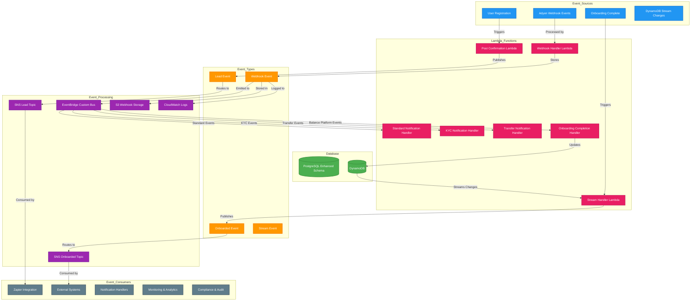
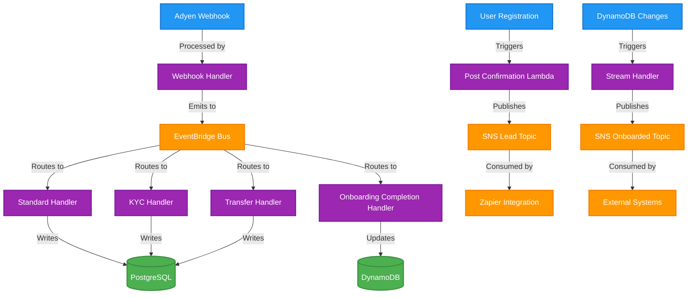
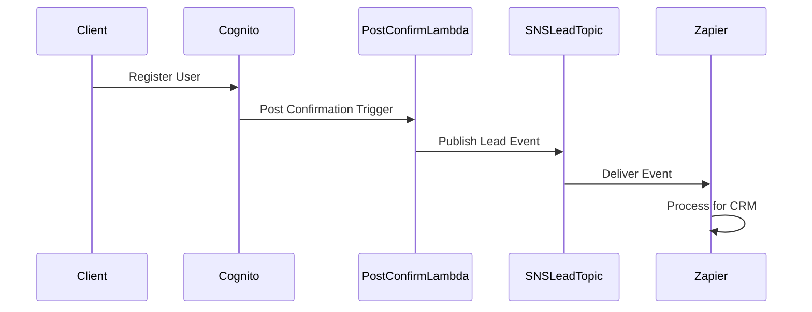
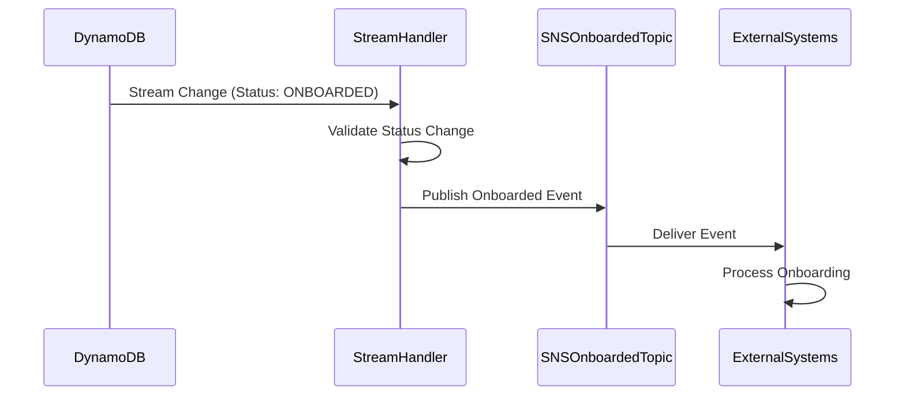
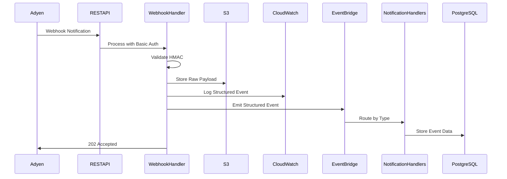
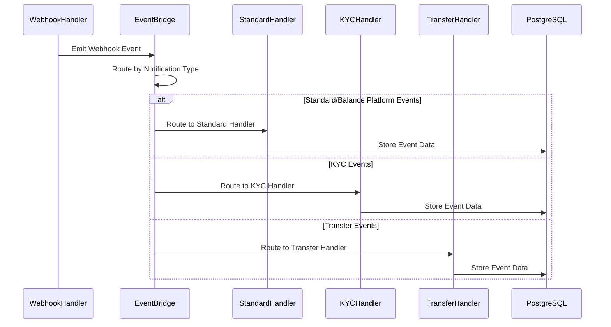

# PayerSync Onboarder Backend Events Architecture

This document provides a comprehensive overview of the event-driven architecture in the PayerSync Onboarder Backend system.

## Events Architecture Diagrams

### Overview
The system processes Adyen webhooks to automatically complete user onboarding by creating sweeps (automatic fund transfers) and confirming onboarding status when all verification requirements are met.

### Detailed Diagram (with Monitoring & Tracing)



## Onboarding Completion & Sweep Creation Flow

### Prerequisites for Full Onboarding
A user is considered **fully onboarded** when **ALL** of these conditions are met:

1. **✅ All Verification Statuses Complete** (6 required capabilities):
   - `receivePayments: true`
   - `sendToTransferInstrument: true` 
   - `sendToBalanceAccount: true`
   - `receiveFromBalanceAccount: true`
   - `receiveFromTransferInstrument: true`
   - `receiveFromPlatformPayments: true`

2. **✅ Transfer Instrument Available**: Must have a valid transfer instrument ID
3. **✅ Balance Account Available**: Must have a valid balance account ID
4. **✅ Sweep Successfully Created**: Must have a valid sweep ID

### What is a Sweep?
A **sweep** is an Adyen Balance Platform configuration that:
- **Automatically transfers funds** from a balance account to a transfer instrument (bank account)
- **Runs daily** (`schedule: { type: 'daily' }`)
- **Triggers at $0** (`triggerAmount: { value: 0 }`) - meaning it transfers all available funds
- **Uses both regular and fast priorities** for optimal fund movement
- **Is a "push" type** - moves money out of Adyen to the user's bank

### Complete Flow Breakdown

#### Phase 1: Webhook Reception & EventBridge Routing
1. **Adyen sends webhook** → `adyenWebhookHandler` receives it
2. **Webhook validation** → HMAC signature validation (skipped for Balance Platform webhooks)
3. **Event classification** → Identified as `balancePlatform.accountHolder.updated`
4. **Event emission** → Structured event sent to EventBridge
5. **EventBridge rule** → `balancePlatformNotificationRule` catches the event
6. **Lambda invocation** → Triggers `onboardingCompletionHandler`

#### Phase 2: Onboarding Completion Processing
1. **User lookup** → Find user by `accountHolderId` from webhook
2. **Verification status check** → Parse Adyen capabilities and update verification statuses
3. **Transfer instrument extraction** → Get transfer instrument ID from capabilities
4. **Sweep creation attempt** → Only if all verifications are complete
5. **Status update** → Mark user as `ONBOARDED` if all conditions met

#### Phase 3: DynamoDB Stream Processing & SNS Event
1. **DynamoDB stream** → Triggers when user status changes to `ONBOARDED`
2. **Stream handler** → `onboardingTableStreamHandler` processes the change
3. **SNS event** → Publishes `ORGANIZATION_ONBOARDED` event to SNS topic

### Key Decision Points

#### When to Create Sweep:
```typescript
const canAttemptSweepCreation =
  allVerificationsComplete &&           // All 6 verifications must be true
  finalTransferInstrumentId &&          // Must have transfer instrument
  existingAdyenData.balanceAccountId && // Must have balance account
  !existingAdyenData.sweepId;          // Must not already have sweep
```

#### When to Mark as ONBOARDED:
```typescript
const shouldMarkAsOnboarded = 
  allVerificationsComplete &&           // All verifications complete
  sweepCreated &&                       // Sweep successfully created
  user.status !== OnboardingStatus.ONBOARDED; // Not already onboarded
```

### Final Confirmation Trigger
The **ONBOARDED** status triggers a **cascade of events**:

1. **DynamoDB update** → User status changed to `ONBOARDED` + `onboardedAt` timestamp
2. **DynamoDB stream** → Automatically triggers due to status change
3. **SNS event** → `ORGANIZATION_ONBOARDED` event published
4. **Downstream systems** → Can consume the SNS event for further processing

This creates a **fully automated financial flow** where users can receive payments through Adyen and have funds automatically swept to their bank accounts on a daily basis.

    %% Connections - Data Storage Flow (Red)
    StandardHandler -->|Writes| PostgreSQL
    KYCHandler -->|Writes| PostgreSQL
    TransferHandler -->|Writes| PostgreSQL
    OnboardingCompletionHandler -->|Updates| DynamoDB

    %% Connections - Stream Processing Flow (Teal)
    DynamoDBChanges -->|Processed by| StreamHandlerLambda
    StreamHandlerLambda -->|Publishes| StreamEvent
    StreamEvent -->|Routes to| SNSOnboardedTopic

    %% Link Styling - Group arrows by functionality
    linkStyle 0,1,2,3 stroke:#2196F3,stroke-width:3px
    linkStyle 4,5,6,7 stroke:#4CAF50,stroke-width:3px
    linkStyle 8,9,10,11,12 stroke:#FF9800,stroke-width:3px
    linkStyle 13,14,15,16 stroke:#9C27B0,stroke-width:3px
    linkStyle 17,18,19,20 stroke:#F44336,stroke-width:3px
    linkStyle 21,22,23 stroke:#00BCD4,stroke-width:3px

    %% Monitoring
    SNSLeadTopic -->|Metrics| Monitoring
    SNSOnboardedTopic -->|Metrics| Monitoring
    EventBridgeBus -->|Metrics| Monitoring
    S3WebhookStorage -->|Access Logs| Monitoring
    CloudWatchLogs -->|Log Analysis| Monitoring
    WebhookHandlerLambda -->|Traces| Monitoring
    StreamHandlerLambda -->|Traces| Monitoring
    StandardHandler -->|Traces| Monitoring
    KYCHandler -->|Traces| Monitoring
    TransferHandler -->|Traces| Monitoring
    OnboardingCompletionHandler -->|Traces| Monitoring
```

### Simplified Diagram (Core Event Flow)



## Event Types and Structure

### 1. Lead Events
**Trigger**: User registration and confirmation through Cognito
**Publisher**: Post Confirmation Lambda
**Topic**: SNS Lead Event Topic
**Consumers**: Zapier Integration, CRM Systems

#### Event Structure
```json
{
  "eventType": "LEAD_CREATED",
  "userId": "user-123",
  "email": "user@example.com",
  "givenName": "John",
  "familyName": "Doe",
  "timestamp": "2025-08-06T21:30:00Z",
  "environment": "staging-whooks",
  "metadata": {
    "source": "cognito",
    "trigger": "post_confirmation"
  }
}
```

### 2. Onboarded Events
**Trigger**: DynamoDB stream changes when user status changes to ONBOARDED
**Publisher**: DynamoDB Stream Handler Lambda
**Topic**: SNS Onboarded Event Topic
**Consumers**: External Systems, Analytics, Compliance

#### Event Structure
```json
{
  "eventType": "USER_ONBOARDED",
  "userId": "user-123",
  "adyenData": {
    "legalEntityId": "LE123456789",
    "accountHolderId": "AH123456789",
    "merchantAccountCode": "RectangleHealthCOM"
  },
  "onboardingData": {
    "pmbData": { /* PMB data */ },
    "merchantData": { /* Merchant data */ }
  },
  "timestamp": "2025-08-06T21:30:00Z",
  "environment": "staging-whooks",
  "metadata": {
    "source": "dynamodb_stream",
    "trigger": "status_change",
    "oldStatus": "READY_FOR_ADYEN",
    "newStatus": "ONBOARDED"
  }
}
```

### 3. Webhook Events
**Trigger**: Adyen payment platform webhook notifications
**Processor**: Webhook Handler Lambda
**Storage**: S3 Webhook Storage + CloudWatch Logs + EventBridge
**Consumers**: Notification Handlers, Monitoring, Compliance, Analytics

#### Event Structure
```json
{
  "eventCode": "AUTHORISATION",
  "pspReference": "QJL7K4JVDVQT3ST5",
  "merchantAccountCode": "RectangleHealthCOM",
  "notificationType": "adyen",
  "live": "false",
  "timestamp": "2025-08-06T21:30:00Z",
  "webhookId": "34df62c6-f9fa-48c0-a781-29cdc691cf8e",
  "environment": "staging-whooks",
  "payload": {
    "live": "false",
    "notificationItems": [
      {
        "NotificationRequestItem": {
          "additionalData": {
            "hmacSignature": "y0UUwnJcE8jectAcgGfuae9ecm2aMYEhUxLnPaFYkKc="
          },
          "amount": {
            "currency": "EUR",
            "value": 0
          },
          "eventCode": "AUTHENTICATION",
          "eventDate": "2025-08-06T22:02:25+02:00",
          "merchantAccountCode": "RectangleHealthCOM",
          "merchantReference": "testMerchantRef1",
          "pspReference": "QJL7K4JVDVQT3ST5",
          "reason": "",
          "success": "true"
        }
      }
    ]
  }
}
```

### 4. EventBridge Webhook Events
**Trigger**: Webhook Handler Lambda emits structured events
**Bus**: EventBridge Custom Bus (`adyen-webhook-bus-{environment}`)
**Consumers**: Specialized Notification Handlers
**Storage**: PostgreSQL Enhanced Schema

#### Event Structure
```json
{
  "Source": "adyen.webhook",
  "DetailType": "adyen.webhook",
  "Detail": {
    "webhookId": "34df62c6-f9fa-48c0-a781-29cdc691cf8e",
    "eventCode": "AUTHORISATION",
    "pspReference": "QJL7K4JVDVQT3ST5",
    "merchantAccountCode": "RectangleHealthCOM",
    "merchantReference": "testMerchantRef1",
    "notificationType": "standard",
    "live": false,
    "timestamp": "2025-08-06T21:30:00Z",
    "eventData": { /* Full webhook payload */ }
  },
  "EventBusName": "adyen-webhook-bus-staging01"
}
```

### 5. Stream Events
**Trigger**: DynamoDB table changes (INSERT, UPDATE, DELETE)
**Processor**: DynamoDB Stream Handler Lambda
**Consumers**: SNS Topics, Monitoring, Analytics

#### Event Structure
```json
{
  "eventType": "DYNAMODB_STREAM",
  "eventName": "MODIFY",
  "userId": "user-123",
  "oldImage": {
    "status": "READY_FOR_ADYEN",
    "adyenData": { /* previous data */ }
  },
  "newImage": {
    "status": "ONBOARDED",
    "adyenData": { /* updated data */ }
  },
  "timestamp": "2025-08-06T21:30:00Z",
  "environment": "staging-whooks"
}
```

## Event Processing Flows

### 1. User Registration Flow


### 2. Onboarding Completion Flow


### 3. Enhanced Webhook Processing Flow


### 4. EventBridge Event Routing Flow


## EventBridge Architecture

### Custom Event Bus
- **Bus Name**: `adyen-webhook-bus-{environment}`
- **Purpose**: Centralized routing for webhook events
- **Features**: Custom rules, retry policies, dead letter queues

### Event Rules

#### Standard Notification Rule
- **Pattern**: `source: adyen.webhook`, `detailType: adyen.webhook`, `detail.notificationType: standard`
- **Target**: Standard Notification Handler
- **Retry**: 2 attempts, 5 minute max event age

#### KYC Notification Rule
- **Pattern**: `source: adyen.webhook`, `detailType: adyen.webhook`, `detail.notificationType: kyc`
- **Target**: KYC Notification Handler
- **Retry**: 2 attempts, 5 minute max event age

#### Transfer Notification Rule
- **Pattern**: `source: adyen.webhook`, `detailType: adyen.webhook`, `detail.notificationType: transfer`
- **Target**: Transfer Notification Handler
- **Retry**: 2 attempts, 5 minute max event age

#### Balance Platform Notification Rule
- **Pattern**: `source: adyen.webhook`, `detailType: adyen.webhook`, `detail.notificationType: balancePlatform`
- **Target**: Standard Notification Handler
- **Retry**: 2 attempts, 5 minute max event age

### Notification Handlers

#### Standard Notification Handler
- **Purpose**: Processes standard webhook notifications and balance platform events
- **Database Operations**: Stores events in PostgreSQL enhanced schema
- **Features**: Deduplication, audit trail, X-Ray tracing

#### KYC Notification Handler
- **Purpose**: Processes KYC-related webhook notifications
- **Database Operations**: Stores KYC events with specialized annotations
- **Features**: KYC validation, compliance tracking, performance monitoring

#### Transfer Notification Handler
- **Purpose**: Processes transfer-related webhook notifications
- **Database Operations**: Stores transfer events with metadata extraction
- **Features**: Transfer validation, metadata analysis, comprehensive tracking

## Event Storage and Retention

### S3 Webhook Storage
- **Bucket**: `{app-name}-{environment}-adyen-webhooks`
- **Path Structure**: `adyen-webhooks/{YYYY}/{MM}/{DD}/{UUID}.json`
- **Retention Policy**: 1 year with IA/Glacier transitions
- **Encryption**: Server-side encryption with S3-managed keys
- **Access Logging**: Enabled for audit purposes

### PostgreSQL Enhanced Schema
- **Purpose**: Comprehensive webhook event storage and analytics
- **Tables**: Legal entities, account holders, accounts, events, receipts, dedupe registry
- **Features**: SCD Type 2 dimensions, JSONB storage, audit trails
- **Retention**: Configurable based on business requirements

### CloudWatch Logs
- **Log Groups**: Separate log groups for each Lambda function
- **Retention**: 14 days for Lambda logs, 1 year for webhook logs
- **Structured Logging**: JSON format for webhook events
- **Metrics**: Custom metrics for event processing

### SNS Topics
- **Lead Event Topic**: `{app-name}-{environment}-lead-event`
- **Onboarded Event Topic**: `{app-name}-{environment}-onboarded-event`
- **Retention**: Messages retained for 14 days
- **Encryption**: KMS encryption for message content

## Event Security and Validation

### Authentication & Authorization
- **Lead Events**: Cognito-based authentication
- **Onboarded Events**: DynamoDB stream-based triggers
- **Webhook Events**: Basic Auth + HMAC signature validation
- **EventBridge Events**: IAM role-based access with custom bus policies
- **Stream Events**: IAM role-based access

### Data Validation
- **Webhook Events**: HMAC signature validation using hex-to-binary conversion
- **EventBridge Events**: Schema validation and type checking
- **Lead Events**: Cognito user attribute validation
- **Onboarded Events**: DynamoDB stream record validation
- **Stream Events**: DynamoDB stream record structure validation

### Encryption
- **In Transit**: TLS 1.2+ for all API communications
- **At Rest**: KMS encryption for SNS messages, S3 objects, and RDS data
- **Secrets**: AWS Secrets Manager with KMS encryption

## Event Monitoring and Observability

### CloudWatch Metrics
- **SNS Topic Metrics**: 
  - `NumberOfMessagesPublished`
  - `NumberOfNotificationsDelivered`
  - `NumberOfNotificationsFailed`
- **EventBridge Metrics**:
  - `TriggeredRules`
  - `InvokedTargets`
  - `ThrottledRules`
  - `FailedInvocations`
- **Lambda Function Metrics**:
  - `Invocations`
  - `Duration`
  - `Errors`
  - `Throttles`

### X-Ray Tracing
- **Distributed Tracing**: All event processing functions
- **Trace Segments**: 
  - Webhook processing
  - EventBridge routing
  - Notification handling
  - Stream processing
  - SNS publishing
  - S3 operations
  - Database operations

### Structured Logging
```json
{
  "level": "INFO",
  "message": "Webhook data processed",
  "eventCode": "AUTHORISATION",
  "pspReference": "QJL7K4JVDVQT3ST5",
  "merchantAccountCode": "RectangleHealthCOM",
  "notificationType": "adyen",
  "live": "false",
  "timestamp": "2025-08-06T21:30:00Z",
  "webhookId": "34df62c6-f9fa-48c0-a781-29cdc691cf8e",
  "environment": "staging-whooks"
}
```

## Event Error Handling

### Webhook Event Errors
- **401 Unauthorized**: Invalid Basic Auth credentials
- **403 Forbidden**: Invalid HMAC signature
- **400 Bad Request**: Invalid payload structure
- **500 Internal Server Error**: Processing failures

### EventBridge Event Errors
- **Retry Logic**: Automatic retries for failed processing (2 attempts)
- **Max Event Age**: 5 minute limit for event processing
- **Error Logging**: Comprehensive error logging with context
- **Dead Letter Queues**: Failed events can be configured for manual processing

### Stream Event Errors
- **Retry Logic**: Automatic retries for failed processing
- **Dead Letter Queue**: Failed events sent to SQS for manual processing
- **Error Logging**: Comprehensive error logging with context

### SNS Event Errors
- **Delivery Failures**: Automatic retries with exponential backoff
- **Dead Letter Queue**: Failed deliveries sent to SQS
- **Monitoring**: CloudWatch alarms for delivery failures

## Event Consumers and Integrations

### Zapier Integration
- **Lead Events**: CRM integration for new user registration
- **Authentication**: Dedicated IAM user with SNS permissions
- **Error Handling**: Retry logic for failed webhook deliveries

### External Systems
- **Onboarded Events**: Business process automation
- **Webhook Events**: Payment processing monitoring
- **Stream Events**: Real-time analytics and reporting

### Notification Handlers
- **Standard Handler**: General webhook processing and balance platform events
- **KYC Handler**: Know Your Customer compliance and verification
- **Transfer Handler**: Fund transfer monitoring and analysis

### Compliance and Audit
- **S3 Access Logs**: Audit trail for webhook storage
- **CloudWatch Logs**: Comprehensive logging for all events
- **X-Ray Traces**: Performance and debugging information
- **PostgreSQL Audit**: Complete event processing history and deduplication

## Environment-Specific Configuration

### Event Routing
- **Environment Tags**: All events tagged with environment
- **Topic Naming**: Environment-specific SNS topic names
- **Bucket Naming**: Environment-specific S3 bucket names
- **EventBridge Bus**: Environment-specific custom event bus

### Event Filtering
- **Webhook Events**: Environment-specific HMAC secrets
- **Lead Events**: Environment-specific user pools
- **Stream Events**: Environment-specific DynamoDB tables
- **EventBridge Rules**: Environment-specific rule names and patterns

### Monitoring Configuration
- **CloudWatch Alarms**: Environment-specific thresholds
- **Log Retention**: Environment-specific retention policies
- **Metrics**: Environment-specific custom metrics
- **EventBridge Monitoring**: Environment-specific event processing metrics

## Best Practices

### Event Design
- **Idempotency**: All events designed for idempotent processing
- **Schema Evolution**: Backward-compatible event schemas
- **Versioning**: Event versioning for schema changes
- **Deduplication**: Event deduplication to prevent duplicate processing

### Performance
- **Async Processing**: All event processing is asynchronous
- **Batch Processing**: Stream events processed in batches
- **Resource Optimization**: Efficient Lambda function configurations
- **EventBridge Routing**: Efficient event routing with custom rules

### Security
- **Least Privilege**: Minimal IAM permissions for event processing
- **Encryption**: End-to-end encryption for all event data
- **Validation**: Comprehensive input validation for all events
- **Deduplication**: Prevents replay attacks and duplicate processing

### Monitoring
- **Real-time Monitoring**: CloudWatch dashboards for event metrics
- **Alerting**: Proactive alerts for event processing failures
- **Tracing**: Distributed tracing for event flow analysis
- **EventBridge Monitoring**: Comprehensive monitoring for custom event bus

## Summary

The enhanced event-driven architecture provides:

✅ **Comprehensive Event Processing**: SNS, EventBridge, and DynamoDB streams
✅ **Enhanced Webhook Handling**: EventBridge routing with specialized handlers
✅ **Advanced Data Storage**: PostgreSQL with SCD Type 2 dimensions
✅ **Event Deduplication**: Prevents duplicate processing and data corruption
✅ **Production Monitoring**: X-Ray tracing, CloudWatch logging, and performance metrics
✅ **Scalable Architecture**: EventBridge-based routing for high-volume processing
✅ **Security**: HMAC validation, deduplication, and encrypted storage

The system is production-ready and can handle high-volume event processing with full observability, data integrity, and comprehensive monitoring capabilities. 